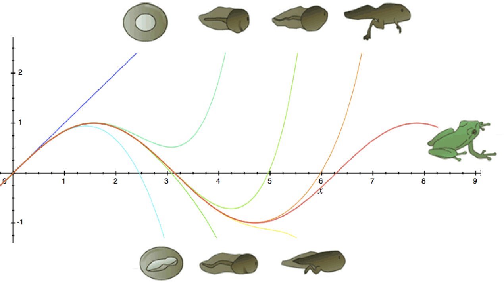
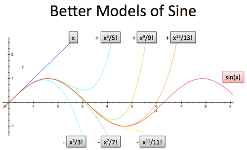
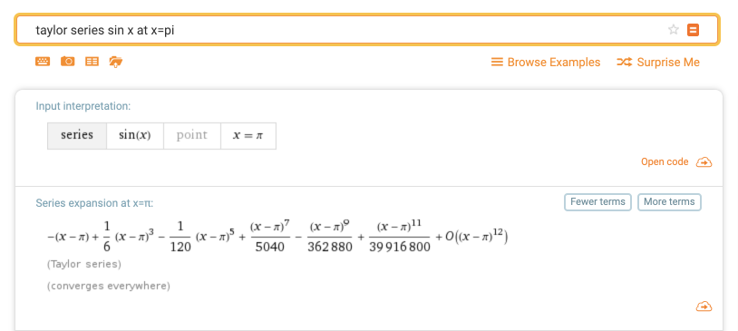
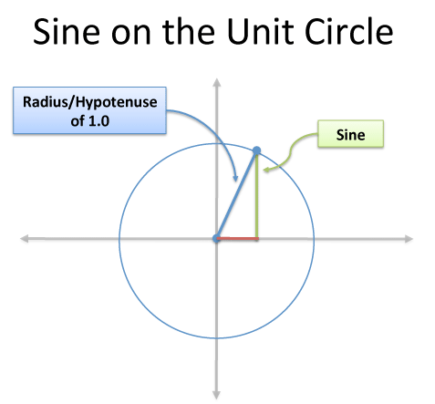

# Hiểu trực quan chuỗi Taylor thông qua sự liên hệ với ADN

📒 [Bài viết gốc](https://betterexplained.com/articles/taylor-series/) 👦 Dịch bởi [Đinh Anh Thi](https://dinhanhthi.com) 💾 Được lưu trên [Github](https://github.com/math2it/BetterExplained-vn-translation/blob/master/docs/phep-tinh-vi-tich-phan-calculus/chuoi-taylor-va-adn.md).


Nếu bạn phát hiện sai sót về **chính tả**, **cách dùng từ**, **thuật ngữ chuyên ngành** hay **đánh máy**. Bạn vui lòng [nhấn vào đây](https://github.com/math2it/BetterExplained-vn-translation/issues) để góp ý cho chúng mình nhé (Đừng quên kèm theo *tên bài viết*)!


## Dẫn đề

Cơ thể con người có một đặc tính kỳ lạ: bạn có thể nghiên cứu về _toàn bộ cơ thể_ từ chỉ _một tế bào_. Chọn một tế bào, nghiên cứu sâu nhân của nó và xác định ADN bên trong. Chỉ với mẫu ADN bé nhỏ này, bạn có thể tạo ra một sinh vật hoàn chỉnh từ đó.

Chúng ta cũng có một sự tương ứng trong thế giới Toán Học! Chọn một hàm số, chọn một điểm cụ thể, nghiên cứu sâu hơn điểm này và trạng thái của hàm tại điểm đó, ta có thể rút ra được đầy đủ thông tin để xây dựng lại hoàn chỉnh hàm số kia. Wow, nó giống như việc bạn làm lại một bộ phim chỉ với một khung hình duy nhất vậy.

Chuỗi Taylor khám phá ra "ADN Toán Học" của hàm số và để cho chúng ta xây dựng lại hàm số đó từ chỉ một điểm duy nhất. Hãy cùng xem nó hoạt động thế nào nhé!

## Lấy thông tin của hàm tại một điểm

Cho hàm số dạng $$f(x)=x^2$$, chúng ta có thể biết gì từ một điểm đơn lẻ?

Thường thì chúng ta sẽ trông đợi tính được giá trị của hàm số tại điểm ấy. Chẳng hạn như tại $$x=4$$ ta tìm được gái trị của hàm $$f(4)=16$$. Nhưng có nhiều thứ bạn có thể đào sâu hơn nữa:

* $$f(x)$$ = Giá trị của hàm tại điểm $$x$$.
* $$f'(x)$$ = Đạo hàm bậc nhất, hay tốc độ thay đổi của hàm khi qua điểm $$x$$ \(Ta còn gọi là _vận tốc_\).
* $$f''(x)$$ = Đạo hàm bậc hai, hay sự thay đổi vận tốc của hàm khi qua $$x$$ \(Ta còn gọi là _gia tốc_\).
* vân vân...

Nếu cứ tiếp tục tính đạo hàm các cấp cao hơn, ta sẽ có thể khảo sát được _sự thay đổi trạng thái_ của hàm nhiều hơn. Có những hàm số cho phép ta tính đạo hàm không giới hạn bậc, khi ấy lượng thông tin mà ta có thể thu nhận cũng không giới hạn tương ứng.

Vậy thì, nếu có được tất cả các thông tin này, chúng ta nên làm gì với chúng? Chính là xây dựng lại hàm đó, tất nhiên rồi!

## Xây dựng hàm từ một điểm

Mục đích của chúng ta là xây dựng một hàm từ một điểm ban đầu. Tuy nhiên làm thế nào có thể miêu tả một hàm một cách chung chung?

Thử tưởng tượng một hàm số bất kỳ, về bản chất, là một hàm đa thức \(với số lượng hạng tử vô tận\) như sau:

$$
\begin{align}
f(x) = c_0 + c_1x + c_2x^2 + c_3x^3 + \ldots \quad (1)
\end{align}
$$

Để có thể gầy dựng lại hàm $$f(x)$$ này, ta cần phải dựa vào giá trị ban đầu $$x_0$$ và một loạt các hạng tử mà chúng ta cung cấp thêm cho nó \(ví dụ như $$c_1x$$\). Mã ADN của hàm $$f$$ trong trường hợp này chính là $$c_0, c_1, c_2,c_3,\ldots$$. Với bộ ADN này, ta có thể miêu tả một cách chính xác hàm số $$f(x)$$ ban đầu.

Đó là với một hàm số có dạng khá tổng quát như hàm đa thức ở trên. Vậy nếu một hàm số nào đó có dạng như hàm $$\sin(x)$$ \(chiều cao của góc $$x$$ trên đường tròn đơn vị\)? Làm cách nào chúng ta có thể tìm được ADN của nó?

Đã đến lúc số $$0$$ ma thuật xuất hiện!

Quay lại hàm đa thức $$f(x)$$ như trên. Thử thay giá trị $$0$$ vào biến, ta sẽ được gì?

$$
\begin{align}
f(0) = c_0 + 0 + 0 +\ldots = c_0.
\end{align}
$$

Mọi hạng tử đều triệt tiêu ngoại trừ hạng tử đầu tiên, $$c_0$$. Điều này cho thấy, **hạng tử đầu tiên của hàm số bất kỳ ta muốn xét đến chính là** $$f(0)$$! Nếu hàm $$f$$ có dạng là $$\sin(x)$$ thì khi ấy thành phần đầu tiên trong ADN của hàm này chính là $$\sin(0)=0$$.

## Xác định thêm các thành phần khác của ADN

Giờ đây ta đã có được $$c_0$$, làm cách nào chúng ta có thể xác định được $$c_1$$ trong công thức sau?

$$
\begin{align}
f(x) = c_0 + c_1x + c_2x^2 + c_3x^3 + \ldots
\end{align}
$$

Một vài ý tưởng:

* Chúng ta có thể cho $$x=1$$ được không? Khi ấy thì $$f(1) = c_0+c_1+c_2+c_3+\ldots$$. Dù chúng ta đã biết trước $$c_0$$, nhưng tất cả các hệ số $$c_i$$ khác đều được cộng dồn vào. Do đó ta không thể truy suất riêng mình $$c_1$$ coi nó là bao nhiêu được!
* Chuyện gì xảy ra nếu chúng ta lấy $$f(x)$$ chia cho $$x$$?

$$
\begin{align}
\dfrac{f(x)}{x} = \dfrac{c_0}{x} + c_1 + c_2x + c_3x^2 + \ldots
\end{align}
$$

Hừm, gần được rồi. Một câu hỏi đặt ra là nếu $$x=0$$ thì làm sao ta có thể chia cho $$0$$ được? Khi ấy ta nghĩ ngay đến đạo hàm của hàm số $$f(x)$$.

Nếu ta lấy đạo hàm của hàm $$f(x)$$, ta sẽ được,

$$
\begin{align}
f'(x) &= (c_0)' + (c_1x)' + c_2x^2 + (c_3x^3)' + \ldots\\
f'(x) &= 0 + c_1 + 2c_2x + 3c_3x^2 + \ldots
\end{align}
$$

Bậc của mỗi hạng tử giảm đi $$1$$ và $$c_0$$, vốn dĩ là một hằng số, sẽ biến thành $$0$$. Quá tiện!

Giờ đây, ta có thể dễ dàng tìm được $$c_1$$ cũng bằng thủ thuật thay thế giá trị $$x=0$$ như ở cách tìm $$c_0$$.

$$
\begin{align}
f'(0) &= 0 + c_1 + 0 + 0 + \ldots = c_1.
\end{align}
$$

Trong ví dụ của chúng ta, $$\sin'(x)=\cos(x)$$, do đó với trường hợp này, $$c_1 =f'(0)=\sin'(0)=\cos(0)=1$$.

Vâng, chúng ta vừa lấy được thêm một phần nữa của ADN! Đây chính là điều kỳ diệu của chuỗi Taylor: Bạn chỉ việc lặp lại quá trình tìm $$c_1$$ cho tất cả các hệ số $$c_i$$ khác là ta có thể tìm được chuỗi ADN của hàm $$f(x)$$!

Hãy thử tiếp với $$c_2$$ xem,

$$
\begin{align}
f''(x) &= 0 + 0 + (2c_2) + (3\cdot 2c_3x^1) + \ldots = c_1.
\end{align}
$$

Sau khi lấy đạo hàm bậc hai, bậc của đa thức lại tiếp tục giảm thêm $$1$$ đơn vị ở mỗi hạng tử. Hai hạng tử đầu tiên đã biến mất, giờ đây ta có thể tìm được $$c_2$$ bằng cách thay $$x=0$$ vào và được $$c_2=f''(0)$$.

Trong ví dụ về $$\sin(x)$$, ta có $$\sin''(x)=-\sin(x)$$ nên

$$
\begin{align}
\displaystyle{f''(0) = \sin''(0) = -\sin(0) = 0 = 2 c_2},
\end{align}
$$

hay $$c_2=0$$.

Nếu ta tiếp tục lấy đạo hàm, ta sẽ có thêm nhiều phép nhân hơn và sẽ hình thành ở các hạng tử các lượng giai thừa dạng $$1!, 2!, 3!, \ldots$$

Khi ấy, **chuỗi Taylor của hàm tại** $$x=0$$ sẽ có dạng,

$$
\begin{align}
\displaystyle{f(x) = f(0) + f'(0) x + \frac{f''(0)}{2!}x^2 + \frac{f'''(0)}{3!}x^3 + \cdots}
\end{align}
$$

\(Về mặt kỹ thuật, chuỗi Taylor tại $$x=0$$ được gọi là chuỗi MacLaurin\)

Còn **tại một điểm** $$x=a$$ **bất kỳ**, chuỗi Taylor sẽ có dạng,

$$
\begin{align}
\displaystyle{f(x) = f(a)+{\frac {f'(a)}{1!}}(x-a)+{\frac {f''(a)}{2!}}(x-a)^{2}+{\frac {f'''(a)}{3!}}(x-a)^{3}+\cdots }
\end{align}
$$

Làm sao có được công thức trên? Ý tưởng tương tự trường hợp $$x=0$$ nhưng ở đây, ta không xét dạng $$f(x)$$ giống như trong $$(1)$$ mà xét nó dưới dạng,

$$
\begin{align}
\displaystyle{f(x) = c_0 + c_1 (x - a) + c_2 (x-a)^2 + c_3(x-a)^3 + \cdots}
\end{align}
$$

Đặt $$y=x-a$$, ta sẽ được

$$
\begin{align}
g(y) = f(y+a) = c_0 + c_1y + c_2y^2 + c_3y^3 + \ldots
\end{align}
$$

Sau đó, xét hàm $$f(x)$$ tại $$x=a$$ cũng chính là xét hàm $$y(y)$$ tại $$y=0$$. Chúng ta quay lại bài toán đã làm như trên!

## Ví dụ: chuỗi Taylor của $$\sin(x)$$

Thay đạo hàm các cấp của hàm số $$\sin(x)$$ vào công thức ở trên, ta được khai triển Taylor của hàm $$\sin(x)$$ xung quanh điểm $$x=0$$ như sau:

$$
\begin{align}
\displaystyle{\sin(x) = x - \frac{x^3}{3!} + \frac{x^5}{5!} - \frac{x^7}{7!} + \dots}
\end{align}
$$

Chúng ta có minh họa cho chuỗi ở trên như sau,

## Một vài nhận xét

**Hàm** $$\sin$$ **có vô hạn các hạng tử trong khai triển Taylor**

Đồ thị hàm $$\sin$$ là một dãy sóng vô hạn nên bạn cũng có thể đoán được là cần phải có vô hạn phần tử trong khai triển Taylor để có thể biểu diễn nó. Trong khi đó hàm số đã có sẵn dạng đa thức như $$f(x)=x^2+3$$ và cũng không có vô hạn bậc các đạo hàm để giữ cho ADN tiếp tục phát triển.

**Hàm** $$\sin$$ **không đầy đủ các hạng tử**

Nếu chúng ta lặp lại các bước tính đạo hàm tương ứng các hạng tử trong khai triển Taylor của hàm $$\sin$$,

$$
\begin{align}
\displaystyle{\sin(0) \xrightarrow{\text{derive}} \cos(0) \xrightarrow{\text{derive}} -\sin(0) \xrightarrow{\text{derive}} -\cos(0) \xrightarrow{\text{derive}} \sin(0) \dots}
\end{align}
$$

tương ứng với các giá trị,

$$
\displaystyle{0, 1, 0, -1, \dots}
$$

Khi ấy chuỗi ADN của $$\sin$$ chỉ là $$[0,1,0,0,-1]$$ lặp đi lặp lại.

**Nếu chúng ta thay đổi giá trị ban đầu, chúng ta sẽ nhận được các ADN khác nhau**

Ví dụ, thay vì lấy giá trị đầu là $$x=0$$, ta chọn $$x=\pi$$, sử dụng trang web [wolframalpha.com](https://www.wolframalpha.com/input/?i=taylor+series+sin+x+at+x%3Dpi), ta có thể biết được khai triển Taylor của $$\sin$$ trong trường hợp này như ở hình dưới đây.

Một vài nhận xét tiếp cho trường hợp ở hình trên:

* ADN của $$\sin$$ lúc này là sự lặp lại của chuỗi $$[0, -1, 0, 1]$$.
* Khi viết rõ ràng các khai triển ra, ta sẽ thấy xuất hiện các con số có vẻ lạ lẫm như $$1, 6, 120, 5040$$. Tuy nhiên, chúng thực chất chỉ là kết quả của phép lũy thừa bình thường của các số $$1! = 1, 3! = 6, 5! =120, 7! = 5040$$. Nhìn chung, chuỗi Taylor sẽ có rất nhiều mẫu số \(lớn\) kỳ dị.
* Lượng $$O(x^{12})$$ có nghĩa là sẽ còn có những hạng tử của $$x$$ ở bậc $$12$$ \($$x^{12}$$\) và cao hơn ở phía sau của khai triển. Bởi vì $$\sin(x)$$ có đạo hàm vô hạn nên ta cũng có tương ứng vô hạn hạng tử nếu khai triển Taylor cho nó. Do đó, máy tính \(hay chính chúng ta nếu muốn biểu diễn nó trên giấy\), ta phải "cắt" nó ở đâu đó. Trong trường hợp này máy tính đã chọn con số $$12$$.

## Ứng dụng: Tìm hàm gần giống

Ứng dụng của chuỗi Taylor là tìm một hàm gần giống với hàm số ta cần. Khi bạn chỉ cần một con nòng nọc, liệu bạn có cần ADN của cả một con nhái không?

Chuỗi Taylor của một hàm có rất nhiều hạng tử và chúng thường được sắp xếp theo mức độ quan trọng:

$$
\displaystyle{f(x) = f(0) + f'(0) x + \frac{f''(0)}{2!}x^2 + \frac{f'''(0)}{3!}x^3 + \cdots}
$$

* $$c_0=f(0)$$, hằng số, giá trị chính xác của hàm tại điểm đang xét.
* $$c_1 = f'(0)x$$, hạng tử tuyến tính, cho chúng ta biết tốc độ cần di chuyển từ điểm đang xét.
* $$c_2 = \frac{f''(0)}{2!}x$$, hàm bình phương, cho chúng ta biết gia tốc của hàm khi qua điểm đang xét.
* Và nhiều hơn thế nữa...

Nếu chúng ta chỉ cần vài ví dụ xung quanh điểm đang xét, điểm ban đầu và hạng tử tuyến tính đã đủ dùng. Khi ấy,

$$
\displaystyle{\text{Mô hình tuyến tính} = \text{điểm đầu} + \text{vận tốc} = f(0) + f'(0)x}
$$

Nếu chúng ta khảo sát dài hơn tí, cần nhiều thông tin hơn, có thể cần tới hạng tử bậc hai. Khi ấy,

$$
\begin{align}
\text{Mô hình bình phương} &= \text{điểm đầu} + \text{vận tốc} + \text{gia tốc}\\
&= f(0) + f'(0)x + \frac{1}{2}f''(0)x^2
\end{align}
$$

Khi càng cần thêm nhiều thông tin, chúng ta càng lấy nhiều hơn các hạng tử trong công thức khai triển của chuỗi Taylor.

## Ứng dụng: So sánh các hàm với nhau

Ứng dụng phổ biến của ADN là gì? Xác định huyết thống!

Nếu chúng ta có vài hàm số, chúng ta có thể so sánh khai triển Taylor của chúng để xem chúng có quan hệ với nhau hay không?

Sau đây là khải triển Taylor của các hàm $$\sin(X), \cos(x)$$ và $$e^x$$:

$$
\begin{align}
\sin x &= x - \frac{x^3}{3!} + \frac{x^5}{5!} - \dots \xrightarrow{ADN} [0, 1, 0 -1, \dots] \\
 \cos x &= 1 - \frac{x^2}{2!} + \frac{x^4}{4!} - \dots \xrightarrow{ADN} [1, 0, -1, 0, \dots] \\
e^x &= 1 + x + \frac{x^2}{2!} + \frac{x^3}{3!} + \dots \xrightarrow{ADN} [1, 1, 1, 1, \dots]
\end{align}
$$

Chúng có quan hệ "họ hàng" gì với nhau chăng? Khi mà các hạng tử đều có dạng một lũy thừa trơn của $$x$$ \(dạng $$x^?$$\) với mẫu số là một giai thừa của một số?

Có điều dấu của ở từng trường hợp là khác nhau. Với $$e^x$$, các hạng tử đều có dấu dương trong khi ở trường hợp của $$\sin(x)$$ và $$\cos(x)$$ là sự xen kẽ của các dấu cộng/trừ. Làm cách nào chúng ta có thể tìm ra sự liên hệ giữa chúng?

Nhận xét tinh tế của Euler \(_Công thức Euler_\) đã giải quyết được vấn đề này bằng cách dựa vào tính chất đặc biệt của số ảo:

$$
\begin{align}
e^{ix}&=1+ix+{\frac {(ix)^{2}}{2!}}+{\frac {(ix)^{3}}{3!}}+{\frac {(ix)^{4}}{4!}}+{\frac {(ix)^{5}}{5!}}+{\frac {(ix)^{6}}{6!}}+{\frac {(ix)^{7}}{7!}}+{\frac {(ix)^{8}}{8!}}+\cdots \\[8pt]&=1+ix-{\frac {x^{2}}{2!}}-{\frac {ix^{3}}{3!}}+{\frac {x^{4}}{4!}}+{\frac {ix^{5}}{5!}}-{\frac {x^{6}}{6!}}-{\frac {ix^{7}}{7!}}+{\frac {x^{8}}{8!}}+\cdots \\[8pt]&=\left(1-{\frac {x^{2}}{2!}}+{\frac {x^{4}}{4!}}-{\frac {x^{6}}{6!}}+{\frac {x^{8}}{8!}}-\cdots \right)+i\left(x-{\frac {x^{3}}{3!}}+{\frac {x^{5}}{5!}}-{\frac {x^{7}}{7!}}+\cdots \right)\\[8pt]&=\cos x+i\sin x.
\end{align}
$$

Wow, chỉ bằng cách dùng số mũ ảo và tách riêng hai nhóm chẵn lẻ của các hạng tử là chúng ta có thể làm xuất hiện hai hàm $$\sin, \cos$$ bên trong khai triển của hàm $$e^x$$, diệu kỳ!

## Phụ lục: Những khoảnh khắc "À thì ra thế!"

**Mối quan hệ với chuỗi Fourier.**

Chuỗi Taylor có mối quan hệ với một chuỗi khác cũng rất nổi tiếng trong toán học là chuỗi Fourier \(ta thường gọi là _**Biến đổi Fourier**_\). Trong khi chuỗi Taylor cho ta biết cấu trúc \textit{ADN đa thức} của hàm thì chuỗi Fourier cho ta biết cấu trúc _ADN tròn_ \(circular\) của hàm.

**Chuỗi Taylor lúc nào cũng hữu dụng?**

Để trả lời cho câu hỏi này, chúng ta cần phải đào sâu về mặt chuyên môn hơn nữa. Tuy nhiên có thể dễ nhận ra không phải lúc nào chúng tacũng đều có thể xấp xỉ một hàm bởi các hàm đa thức. Ví dụ như hàm $$\ln(1+x)$$, cho dù ta lấy nhiều hạng tử như thế nào chăng nữa thì hiếm khi có được một xấp xỉ đủ "tốt" tại điểm $$x=1$$ \([nguồn hình](https://en.wikipedia.org/wiki/File:Logarithm_GIF.gif)\).

**Chuyển đổi định nghĩa hình học sang định nghĩa đại số.**

Nếu như hàm $$\sin$$ thường được định nghĩa hình học là _chiều cao của một đường trên đường tròn đơn vị_ \(Hình bên dưới\) thì việc chuyển định nghĩa này sang một công thức đại số có vẻ không khả thi. Chuỗi Taylor cung cấp cho chúng ta một quy trình dễ dàng hơn trong việc "định nghĩa đại số một hàm": Nếu chúng ta biết một giá trị của hàm \(một điểm cụ thể\) và cách nó thay đổi \(các giá trị của đạo hàm các cấp tại điểm đó\) thì chúng ta có thể "truy ngược" lại được ADN và hàm đó.

Tương tực, miêu tả cho hàm $$e^x$$ là "hàm mà đạo hàm của nó cũng là chính nó". Điều này suy ra ADN của nó là $$[1,1,1,1]$$ và đa thức sau khai triển sẽ là,

$$
f(x) = 1 + \frac{1}{1!}x + \frac{1}{2!}x^2 + \frac{1}{3!}x^3 + \dots
$$

Chúng ta đã đi từ định nghĩa hình thức \(bằng lời\) sang định nghĩa chính xác về mặt toán học \(bằng chuỗi Taylor\).

Hãy đọc lại và suy ngẫm nhé.

Chúc bạn học toán vui.

